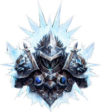

# Warfrost - Rise of Chaos

Warfrost is an immersive real-time strategy (RTS) game set in a Realm of Chaos. Engage in epic battles, command mythical creatures, and lead your faction to victory in a war-torn world.
## How It Works

Warfrost is a 1 vs 1 RTS game where players control one of four powerful races. Engage in intense battles, strategically manage resources, and build your armies to outmaneuver and conquer your opponent. The game features the following:

- **Race Selection**: Choose your faction from four distinct races, each with its own strengths, weaknesses, and unique units.
- **Resource Management**: Gather resources, such as gold, wood, and magical artifacts, to fuel your faction's growth and expansion.
- **Base Building**: Construct and upgrade buildings to train units, conduct research, and unlock powerful upgrades.
- **Unit Control**: Command diverse units including mythical creatures, warriors, and spellcasters, each with unique abilities and strengths.
- **Tactical Warfare**: Plan your strategies, execute tactical maneuvers, and outsmart your opponent in fast-paced battles across immersive maps.

## Technologies

Warfrost leverages the following technologies to power the game:

- **Rust**: The back-end of the game is developed in Rust, a high-performance and reliable programming language, ensuring efficient server-client communication and robust game mechanics.
- **Typescript**: The front-end of the game is built with Typescript, a powerful and scalable language, providing an interactive and visually appealing user interface.
- **WebSockets**: Real-time communication between the server and clients is established using WebSockets, enabling seamless multiplayer gameplay and synchronized game state updates.

In addition to these core technologies, Warfrost incorporates industry-standard tools and frameworks for efficient development, deployment, and containerization:

- **Docker**: The game can be containerized using Docker, allowing for easy deployment and management of the game's back-end and front-end components.
- **Kubernetes**: For scaling and managing the game infrastructure, Kubernetes can be utilized, enabling efficient container orchestration and high availability.

## Game Lore

In the world of Warfrost, four mighty races fight for what each of them judge right or wrong; living centuries of war and conflict. Each race possesses unique characteristics, strengths, and a rich history:

- **Humans**: The stalwart defenders of justice and civilization, skilled in both melee combat and powerful spellcasting. They seek harmony and strive to restore balance to the war-torn realm.
- **Elves**: Masters of archery, magic, and ancient wisdom. Elves are guardians of the natural world, harnessing the power of nature itself to defend their lands from all who would desecrate it.
- **Dwarves**: Expert craftsmen and warriors, Dwarves excel in heavy infantry and siege warfare. They are driven by a thirst for exploration and the reclamation of their ancestral underground realms.
- **Orcs**: Ferocious and relentless, Orcs are born warriors, wielding brutal strength and dark magics. They seek domination and conquest, believing that only the strongest survive.

Unleash the power of your chosen race, lead your armies to victory, and shape the destiny of the Warfrost realm.

## Contributing

Contributions to Warfrost are welcome! Whether you want to enhance the gameplay, improve the user interface, or fix bugs, please check out our [contribution guidelines](CONTRIBUTING.md) to get started.

## License

Warfrost is released under the [Apache-2.0 License](LICENSE). Feel free to use, modify, and distribute the game as per the terms of the license.

